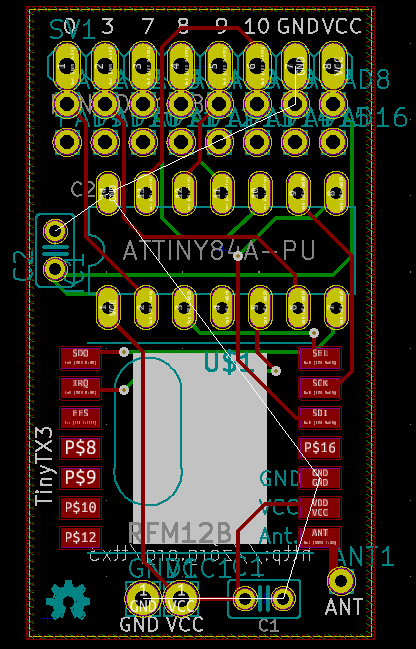

# TinyTX3 Hardware

Archived from Nathan's website [via Archive.org](https://web.archive.org/web/20150202220320/http://nathan.chantrell.net/tinytx-wireless-sensor/):

## Schematic

* [Eagle file](tinytx3.sch)
* [KiCad files](KiCad/)

## Board

* [Eagle file](tinytx3.brd)
* [KiCad files](KiCad/)

## Case

* [OpenSCAD](TinyTX_Case.scad)

## Implementation

### Pinout

### AA implementation

### LiPo implementation

