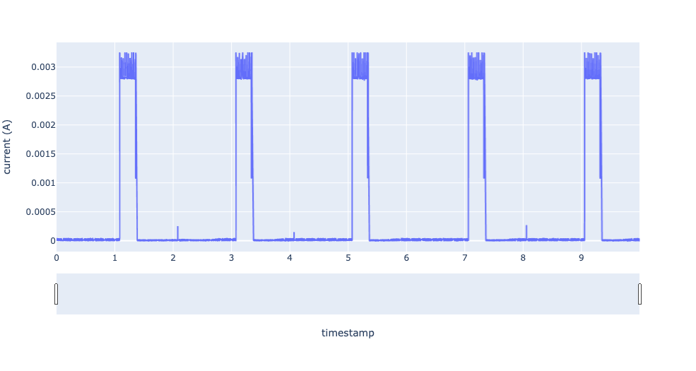

# HC-SR04

Low power Ultrasonic range-finder:

1. CS-100 based HC-SR04 (3.3V)
2. NewPing with [modification to support ATTiny1614](https://bitbucket.org/teckel12/arduino-new-ping/pull-requests/8)
3. BSS84 MOSFET to switch on HC-SR04 (inverse), or power directly off GPIO

## Energy usage

* 20uA background =
* 3mA for ~150ms every 10 mins = 0.45mAs
